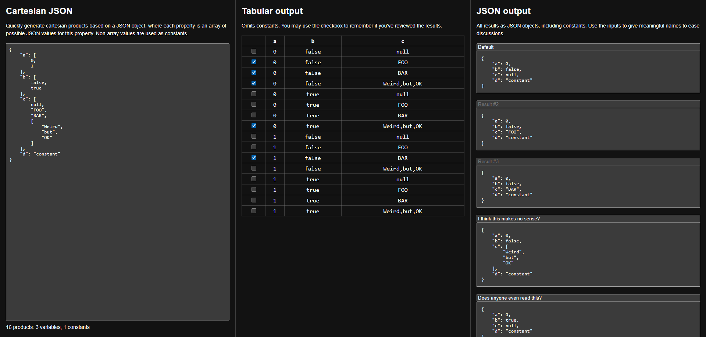

# Cartesian JSON

Quickly generate cartesian products based on a JSON object.
Helps visualizing and discussion JSON structures or combinations in general.

Visit [janmalch.github.io/Cartesian-JSON](https://janmalch.github.io/Cartesian-JSON/)

